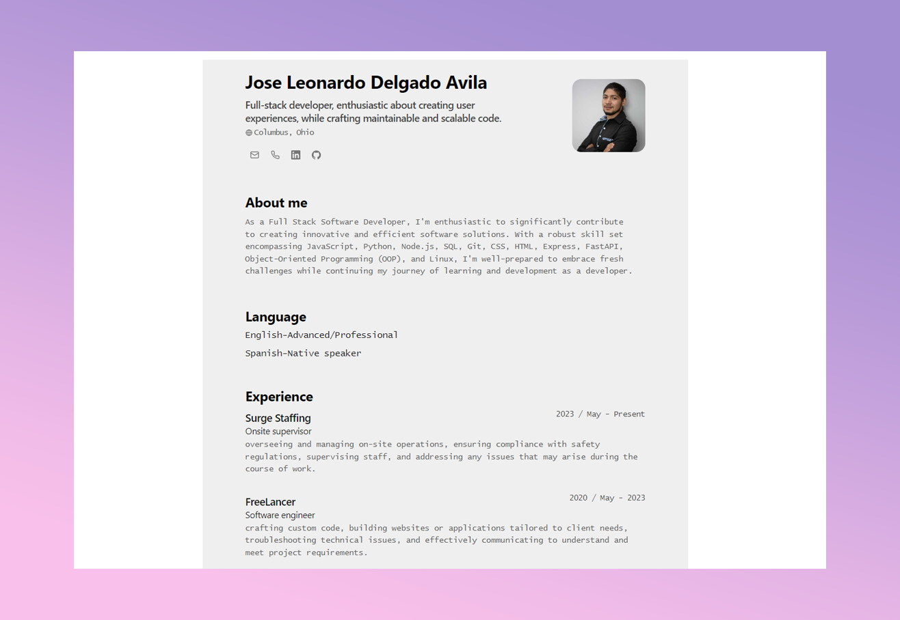
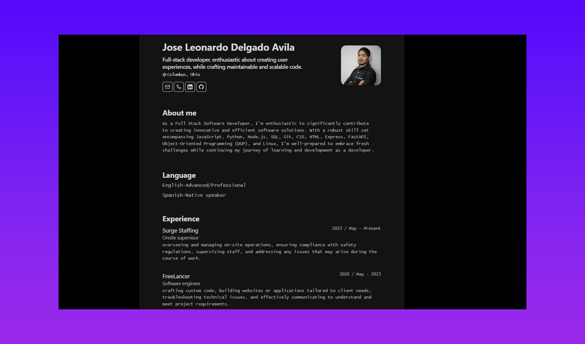

<div align="center">
</img>
<h2>
    <em>Minimalist</em> Resume Layout for Web and PDF
</h2>
<p>
JSON CV Schema from <a href="https://jsonresume.org/schema/">jsonresume.org</a>
</p>

<p>
Based on the design by <a href="https://github.com/BartoszJarocki/cv">Bartosz Jarocki</a>

</p>
<p>
Based on the design by <a href="https://github.com/midudev/minimalist-portfolio-json">Midudev</a>

</p>
</div>

<div align="center">
    <a href="#🚀-start">
        Start
    </a>
    <span>&nbsp;✦&nbsp;</span>
    <a href="#🧞-commands">
        Commands
    </a>
    <span>&nbsp;✦&nbsp;</span>
    <a href="#🔑-license">
        License
    </a>
    <span>&nbsp;✦&nbsp;</span>
    <a href="https://midu.dev">
        Personal
    </a>
   
</div>

<p></p>

<div align="center">


</div>

</img>
</img>
</img>

## 🛠️ Stack

-   [**Astro**](https://astro.build/) - The web framework for the modern era.
-   [**Typescript**](https://www.typescriptlang.org/) - JavaScript with typing syntax.
-   [**Ninja Keys**](https://github.com/ssleptsov/ninja-keys) - Dropdown menu with keyboard shortcuts made in pure Javascript.

## 🚀 Start

### 1. Use this [repo](https://github.com/Lealdos/portafolio-json/) as an Astro project _template_

-   I use [pnpm](https://pnpm.io/installation) as the package manager and bundler.

````bash
# Enable pnpm on MacOS, WSL & Linux:
corepack enable
corepack prepare pnpm@latest --activate

# Initialize the project
pnpm create astro@latest -- --template Lealdos/portafolio-json/


```bash
# Active pnpm en MacOS, WSL & Linux:
corepack enable
corepack prepare pnpm@latest --activate

# Initialize the project
pnpm create astro@latest -- --template Lealdos/portafolio-json/
````

### 2. Add your content:

Edit the cv.json file to create your own Printable Portfolio/CV.

### 3. Launch the development server:

```bash
# Enjoy the result
pnpm dev
```

1. Open [**http://localhost:4321**](http://localhost:4321) in your browser to see the result 🚀

## 🧞 Commands

|     | Command         | Action                                                               |
| :-- | :-------------- | :------------------------------------------------------------------- |
| ⚙️  | `dev` o `start` | Run local server `localhost:4321`.                                   |
| ⚙️  | `build`         | Checks for possible errors and packages for production in `./dist/`. |
| ⚙️  | `preview`       | Local preview at `localhost:4321`                                    |

## 🔑 License

[MIT](LICENSE.txt) - Create by [**midudev**](https://midu.dev) and [**Lealdos**](<[https://](https://github.com/Lealdos)>).
